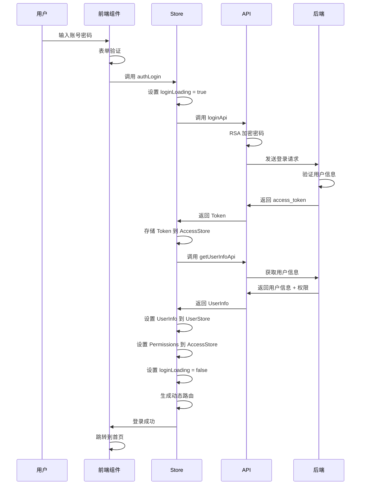
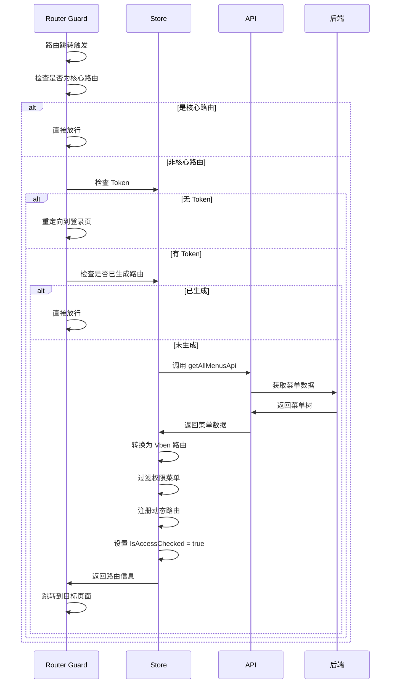

# 开发文档

## 目录

- [Lxy-Vue-Admin 开发文档](#lxy-vue-admin-开发文档)
  - [目录](#目录)
  - [1. 项目概述](#1-项目概述)
    - [1.1 项目简介](#11-项目简介)
    - [1.2 技术栈](#12-技术栈)
      - [核心框架与库](#核心框架与库)
      - [工具库](#工具库)
      - [开发工具](#开发工具)
    - [1.3 项目特性](#13-项目特性)
  - [2. 环境配置指南](#2-环境配置指南)
    - [2.1 环境要求](#21-环境要求)
    - [2.2 安装步骤](#22-安装步骤)
      - [1. 获取项目代码](#1-获取项目代码)
      - [2. 安装依赖](#2-安装依赖)
      - [3. 启动开发服务器](#3-启动开发服务器)
      - [4. 打包构建](#4-打包构建)
    - [2.3 开发环境配置](#23-开发环境配置)
      - [环境变量配置](#环境变量配置)
      - [关键配置项说明](#关键配置项说明)
      - [代理配置](#代理配置)
    - [2.4 生产环境打包](#24-生产环境打包)
      - [构建命令](#构建命令)
      - [构建输出](#构建输出)
      - [部署配置](#部署配置)
  - [3. 目录结构说明](#3-目录结构说明)
    - [3.1 整体目录结构](#31-整体目录结构)
    - [3.2 核心目录详解](#32-核心目录详解)
      - [`apps/web-antd/src/` 目录结构](#appsweb-antdsrc-目录结构)
  - [4. 项目架构设计](#4-项目架构设计)
    - [4.1 架构概览](#41-架构概览)
    - [4.2 技术架构](#42-技术架构)
      - [核心技术栈](#核心技术栈)
      - [请求架构](#请求架构)
    - [4.3 核心模块设计](#43-核心模块设计)
      - [4.3.1 认证授权模块](#431-认证授权模块)
      - [4.3.2 路由权限模块](#432-路由权限模块)
      - [4.3.3 组件适配器](#433-组件适配器)
  - [5. 核心功能模块详解](#5-核心功能模块详解)
    - [5.1 认证授权模块](#51-认证授权模块)
      - [5.1.1 登录认证](#511-登录认证)
      - [5.1.2 Token 管理](#512-token-管理)
    - [5.2 路由权限模块](#52-路由权限模块)
      - [5.2.1 路由分类](#521-路由分类)
      - [5.2.2 路由守卫](#522-路由守卫)
      - [5.2.3 后端路由转 Vben 路由](#523-后端路由转-vben-路由)
    - [5.3 状态管理模块](#53-状态管理模块)
      - [5.3.1 Store 分类](#531-store-分类)
      - [5.3.2 字典 Store](#532-字典-store)
      - [5.3.3 租户 Store](#533-租户-store)
    - [5.4 组件系统](#54-组件系统)
      - [5.4.1 组件分类](#541-组件分类)
      - [5.4.2 上传组件](#542-上传组件)
      - [5.4.3 字典组件](#543-字典组件)
    - [5.5 国际化模块](#55-国际化模块)
      - [5.5.1 语言包结构](#551-语言包结构)
      - [5.5.2 使用方法](#552-使用方法)
    - [5.6 字典管理模块](#56-字典管理模块)
      - [5.6.1 字典类型](#561-字典类型)
      - [5.6.2 字典使用](#562-字典使用)
    - [5.7 租户管理模块](#57-租户管理模块)
      - [5.7.1 租户功能](#571-租户功能)
      - [5.7.2 租户切换](#572-租户切换)
    - [5.8 文件上传模块](#58-文件上传模块)
      - [5.8.1 上传类型](#581-上传类型)
      - [5.8.2 OSS 配置](#582-oss-配置)
  - [6. API 接口文档](#6-api-接口文档)
    - [6.1 API 架构设计](#61-api-架构设计)
      - [6.1.1 API 目录结构](#611-api-目录结构)
      - [6.1.2 API 定义规范](#612-api-定义规范)
    - [6.2 核心接口](#62-核心接口)
      - [6.2.1 认证接口](#621-认证接口)
      - [6.2.2 用户接口](#622-用户接口)
      - [6.2.3 菜单接口](#623-菜单接口)
    - [6.3 业务接口](#63-业务接口)
      - [6.3.1 用户管理接口](#631-用户管理接口)
      - [6.3.2 角色管理接口](#632-角色管理接口)
      - [6.3.3 菜单管理接口](#633-菜单管理接口)
      - [6.3.4 字典管理接口](#634-字典管理接口)
    - [6.4 接口请求配置](#64-接口请求配置)
      - [6.4.1 请求配置项](#641-请求配置项)
      - [6.4.2 请求加密](#642-请求加密)
      - [6.4.3 错误处理](#643-错误处理)
  - [7. 数据模型定义](#7-数据模型定义)
    - [7.1 通用数据模型](#71-通用数据模型)
    - [7.2 系统模块数据模型](#72-系统模块数据模型)
      - [7.2.1 用户模块](#721-用户模块)
      - [7.2.2 角色模块](#722-角色模块)
      - [7.2.3 菜单模块](#723-菜单模块)
      - [7.2.4 部门模块](#724-部门模块)
      - [7.2.5 字典模块](#725-字典模块)
      - [7.2.6 OSS 模块](#726-oss-模块)
      - [7.2.7 租户模块](#727-租户模块)
    - [7.3 监控模块数据模型](#73-监控模块数据模型)
      - [7.3.1 操作日志](#731-操作日志)
      - [7.3.2 登录日志](#732-登录日志)
      - [7.3.3 在线用户](#733-在线用户)
    - [7.4 工作流模块数据模型](#74-工作流模块数据模型)
      - [7.4.1 流程定义](#741-流程定义)
      - [7.4.2 流程实例](#742-流程实例)
      - [7.4.3 流程任务](#743-流程任务)
  - [8. 数据流程与关键业务逻辑](#8-数据流程与关键业务逻辑)
    - [8.1 登录认证流程](#81-登录认证流程)
      - [8.1.1 完整登录流程](#811-完整登录流程)
      - [8.1.2 关键代码](#812-关键代码)
    - [8.2 路由加载流程](#82-路由加载流程)
      - [8.2.1 路由加载流程图](#821-路由加载流程图)
      - [8.2.2 关键代码](#822-关键代码)
    - [8.3 数据加密流程](#83-数据加密流程)
      - [8.3.1 加密配置](#831-加密配置)
      - [8.3.2 加密流程](#832-加密流程)
      - [8.3.3 关键代码](#833-关键代码)
    - [8.4 动态菜单生成流程](#84-动态菜单生成流程)
      - [8.4.1 菜单转换流程](#841-菜单转换流程)
      - [8.4.2 特殊路由处理](#842-特殊路由处理)
  - [9. 开发规范与最佳实践](#9-开发规范与最佳实践)
    - [9.1 代码规范](#91-代码规范)
      - [9.1.1 TypeScript 规范](#911-typescript-规范)
      - [9.1.2 Vue 组件规范](#912-vue-组件规范)
    - [9.2 组件开发规范](#92-组件开发规范)
      - [9.2.1 组件设计原则](#921-组件设计原则)
      - [9.2.2 Props 定义](#922-props-定义)
      - [9.2.3 Events 定义](#923-events-定义)
    - [9.3 API 开发规范](#93-api-开发规范)
      - [9.3.1 API 分层](#931-api-分层)
      - [9.3.2 错误处理](#932-错误处理)
    - [9.4 状态管理规范](#94-状态管理规范)
      - [9.4.1 Store 定义](#941-store-定义)
      - [9.4.2 Store 使用](#942-store-使用)
    - [9.5 提交规范](#95-提交规范)
      - [9.5.1 Commit 格式](#951-commit-格式)
      - [9.5.2 Type 类型](#952-type-类型)
      - [9.5.3 示例](#953-示例)
    - [9.6 最佳实践](#96-最佳实践)
      - [9.6.1 性能优化](#961-性能优化)
      - [9.6.2 代码复用](#962-代码复用)
  - [10. 常见问题解决方案](#10-常见问题解决方案)
    - [10.1 环境配置问题](#101-环境配置问题)
      - [10.1.1 Node 版本不兼容](#1011-node-版本不兼容)
      - [10.1.2 pnpm 依赖安装失败](#1012-pnpm-依赖安装失败)
    - [10.2 开发常见问题](#102-开发常见问题)
      - [10.2.1 热更新不生效](#1021-热更新不生效)
      - [10.2.2 TypeScript 类型错误](#1022-typescript-类型错误)
      - [10.2.3 跨域问题](#1023-跨域问题)
    - [10.3 部署问题](#103-部署问题)
      - [10.3.1 打包后页面空白](#1031-打包后页面空白)
      - [10.3.2 静态资源 404](#1032-静态资源-404)
  - [11. 调试指南](#11-调试指南)
    - [11.1 开发调试](#111-开发调试)
      - [11.1.1 Vue DevTools](#1111-vue-devtools)
      - [11.1.2 Pinia DevTools](#1112-pinia-devtools)
    - [11.2 网络请求调试](#112-网络请求调试)
      - [11.2.1 浏览器 DevTools](#1121-浏览器-devtools)
      - [11.2.2 Alova 调试](#1122-alova-调试)
    - [11.3 性能优化](#113-性能优化)
      - [11.3.1 性能分析](#1131-性能分析)
      - [11.3.2 常见性能问题](#1132-常见性能问题)
  - [附录](#附录)
    - [A. 相关资源链接](#a-相关资源链接)
    - [B. 开发工具推荐](#b-开发工具推荐)
    - [C. 更新日志](#c-更新日志)

---

## 1. 项目概述

### 1.1 项目简介

Lxy-Vue-Admin 是基于 [Vben Admin 5](https://github.com/vbenjs/vue-vben-admin) 和 [Antdv Next](https://antdv-next.com/) 开发的企业级中后台管理系统前端项目。该项目与 Lxy-Spring 后端框架深度集成，提供了一套完整的前端解决方案。

**项目定位：**
- 企业级中后台管理系统前端框架
- 基于 Monorepo 架构的现代化前端项目
- 与 Lxy-Spring 后端深度集成的前端实现

### 1.2 技术栈

#### 核心框架与库

| 技术 | 版本 | 说明 |
|------|------|------|
| Vue | 3.5.13 | 渐进式 JavaScript 框架 |
| Vben Admin | 5.7.0 | 企业级中后台前端解决方案 |
| Antdv Next | 1.1.8 | 基于 Vue 3 的企业级 UI 组件库 |
| Vue Router | 4.x | Vue.js 官方路由管理器 |
| Pinia | 2.x | Vue 3 推荐的状态管理库 |
| TypeScript | 5.x | JavaScript 的超集 |
| Vite | 5.x | 下一代前端构建工具 |

#### 工具库

| 技术 | 说明 |
|------|------|
| Alova | 轻量级请求策略库 |
| Axios | HTTP 请求库 |
| VueUse | Vue 3 Composition API 工具集 |
| Lodash-es | JavaScript 工具库 |
| Dayjs | 轻量级日期处理库 |
| Echarts | 可视化图表库 |
| Tinymce | 富文本编辑器 |
| Cropperjs | 图片裁剪库 |

#### 开发工具

| 技术 | 说明 |
|------|------|
| pnpm | 高性能的 npm 包管理器 |
| Turbo | Monorepo 构建工具 |
| ESLint | 代码质量检查工具 |
| Stylelint | CSS 代码检查工具 |
| Prettier | 代码格式化工具 |
| Commitlint | Git 提交信息检查工具 |

### 1.3 项目特性

- **Monorepo 架构**：使用 pnpm workspace 和 Turbo 进行多包管理
- **TypeScript 支持**：完整的类型定义和类型检查
- **组件化开发**：基于 Antdv Next 的高度封装组件系统
- **动态路由**：支持后端动态路由配置和权限控制
- **多租户支持**：内置多租户管理和切换功能
- **数据加密**：支持 RSA/AES 前后端数据加密传输
- **国际化**：完整的多语言支持（中文/英文）
- **响应式设计**：适配多种屏幕尺寸和设备
- **主题定制**：支持主题切换和个性化配置
- **代码规范**：完善的代码规范和自动化检查工具

---

## 2. 环境配置指南

### 2.1 环境要求

**最低环境要求：**
- Node.js: ^20.19.0 或 ^22.18.0 或 ^24.0.0
- pnpm: >= 10.0.0
- 浏览器：Chrome 88+ 或现代浏览器（不支持 IE）

**推荐环境：**
- Node.js: 22.18.0 或 24.0.0
- pnpm: 最新版本
- 开发工具：VS Code + Volar 插件

### 2.2 安装步骤

#### 1. 获取项目代码

```bash
git clone https://gitee.com/my_spaces/lxy-vue-admin.git
cd lxy-vue-admin
```

#### 2. 安装依赖

```bash
pnpm install
```

#### 3. 启动开发服务器

```bash
pnpm dev:antd
```

#### 4. 打包构建

```bash
# 生产环境打包
pnpm build:antd

# 测试环境打包
pnpm build:antd:test
```

### 2.3 开发环境配置

#### 环境变量配置

项目使用 `.env` 文件管理环境变量，主要配置文件：

- `.env` - 通用环境变量
- `.env.development` - 开发环境配置
- `.env.production` - 生产环境配置
- `.env.test` - 测试环境配置

#### 关键配置项说明

```properties
# 端口号
VITE_PORT=5666

# 打包路径（部署子路径）
VITE_BASE=/

# 是否打开 devtools
VITE_DEVTOOLS=false

# 是否注入全局 loading
VITE_INJECT_APP_LOADING=true

# 后台请求路径（在 vite.config.mts 配置代理）
VITE_GLOB_API_URL=/api

# 全局加密开关
VITE_GLOB_ENABLE_ENCRYPT=true

# RSA 公钥（请求加密使用）
VITE_GLOB_RSA_PUBLIC_KEY=你的公钥

# RSA 私钥（响应解密使用）
VITE_GLOB_RSA_PRIVATE_KEY=你的私钥

# 客户端 ID
VITE_GLOB_APP_CLIENT_ID=e5cd7e4891bf95d1d19206ce24a7b32e

# 开启 SSE（Server-Sent Events）
VITE_GLOB_SSE_ENABLE=true

# 开启 WebSocket
VITE_GLOB_WEBSOCKET_ENABLE=false
```

#### 代理配置

在 `apps/web-antd/vite.config.ts` 中配置开发代理：

```typescript
server: {
  proxy: {
    '/api': {
      changeOrigin: true,
      rewrite: (path) => path.replace(/^\/api/, ''),
      target: 'http://localhost:8080', // 后端服务地址
      ws: true, // WebSocket 代理
    },
  },
}
```

### 2.4 生产环境打包

#### 构建命令

```bash
# 生产环境打包
pnpm build:antd

# 分析打包结果
pnpm build:analyze
```

#### 构建输出

打包完成后，产物输出到 `apps/web-antd/dist` 目录，包含：
- `index.html` - 入口 HTML 文件
- `assets/` - 静态资源目录（JS、CSS、图片等）
- `favicon.ico` - 网站图标

#### 部署配置

1. 将 `dist` 目录内容部署到 Web 服务器
2. 配置服务器将所有请求重定向到 `index.html`（SPA 应用需要）
3. 根据需要修改 `.env.production` 中的 API 地址

**Nginx 配置示例：**

```nginx
server {
    listen 80;
    server_name your-domain.com;
    root /path/to/dist;
    index index.html;

    location / {
        try_files $uri $uri/ /index.html;
    }

    location /api/ {
        proxy_pass http://backend-server:8080/;
        proxy_set_header Host $host;
        proxy_set_header X-Real-IP $remote_addr;
    }
}
```

---

## 3. 目录结构说明

### 3.1 整体目录结构

```
Lxy-Vue-Admin/
├── .vscode/                    # VS Code 配置
├── apps/                       # 应用目录（Monorepo 子包）
│   └── web-antd/              # Antdv Next 应用
│       ├── public/            # 公共静态资源
│       ├── src/               # 源代码目录
│       ├── .env*              # 环境变量配置
│       ├── index.html         # HTML 模板
│       ├── package.json       # 依赖配置
│       └── vite.config.ts     # Vite 配置
├── docs/                       # 文档目录
├── scripts/                    # 脚本工具
├── package.json               # 根依赖配置
├── pnpm-workspace.yaml        # pnpm workspace 配置
├── turbo.json                 # Turbo 配置
└── README.md                  # 项目说明
```

### 3.2 核心目录详解

#### `apps/web-antd/src/` 目录结构

```
src/
├── adapter/                    # 组件适配器
│   ├── component/             # 组件适配器定义
│   ├── form.ts                # 表单组件适配
│   └── vxe-table.ts           # VXE Table 适配
├── api/                        # API 接口定义
│   ├── core/                  # 核心接口（认证、用户、菜单等）
│   ├── monitor/               # 监控模块接口
│   ├── system/                # 系统管理接口
│   ├── tool/                  # 工具模块接口
│   ├── workflow/              # 工作流模块接口
│   ├── common.d.ts            # 通用类型定义
│   ├── helper.ts              # API 辅助函数
│   └── index.ts               # API 导出
├── components/                 # 业务组件
│   ├── cropper/               # 图片裁剪组件
│   ├── dict/                  # 字典组件
│   ├── global/                # 全局组件
│   ├── table/                 # 表格组件
│   ├── tenant-toggle/         # 租户切换组件
│   ├── tinymce/               # 富文本编辑器
│   ├── tree/                  # 树形组件
│   └── upload/                # 上传组件
├── layouts/                    # 布局组件
│   ├── auth.vue               # 认证页面布局
│   ├── basic.vue              # 基础布局
│   └── index.ts
├── locales/                    # 国际化配置
│   ├── langs/                 # 语言包
│   │   ├── zh-CN/             # 中文
│   │   └── en-US/             # 英文
│   └── index.ts
├── router/                     # 路由配置
│   ├── routes/                # 路由定义
│   │   ├── modules/           # 路由模块
│   │   ├── core.ts            # 核心路由
│   │   └── index.ts           # 路由导出
│   ├── access.ts              # 路由权限处理
│   ├── guard.ts               # 路由守卫
│   └── index.ts
├── store/                      # 状态管理
│   ├── auth.ts                # 认证状态
│   ├── dict.ts                # 字典状态
│   ├── index.ts               # Store 初始化
│   ├── notify.ts              # 通知状态
│   └── tenant.ts              # 租户状态
├── utils/                      # 工具函数
│   ├── file/                  # 文件处理工具
│   ├── http/                  # HTTP 请求工具
│   ├── check-update.tsx       # 版本更新检查
│   ├── context.tsx            # 上下文工具
│   ├── dict.ts                # 字典工具
│   └── message.ts             # 消息工具
└── views/                      # 页面视图
    ├── _core/                 # 核心页面
    │   ├── about/             # 关于页面
    │   ├── authentication/    # 认证页面
    │   ├── fallback/          # 异常页面
    │   └── profile/           # 个人中心
    ├── dashboard/             # 仪表盘页面
    ├── demo/                  # 演示页面
    ├── monitor/               # 监控页面
    ├── system/                # 系统管理页面
    ├── tool/                  # 工具页面
    └── workflow/              # 工作流页面
```

---

## 4. 项目架构设计

### 4.1 架构概览

项目采用分层架构设计，从上到下分为：

```
┌─────────────────────────────────────┐
│         视图层 (Views)              │
│    页面组件、业务逻辑实现            │
├─────────────────────────────────────┤
│         组件层 (Components)          │
│    业务组件、通用组件封装             │
├─────────────────────────────────────┤
│         布局层 (Layouts)             │
│    页面布局、框架结构                 │
├─────────────────────────────────────┤
│    服务层 (Store / API / Router)    │
│    状态管理、数据请求、路由控制        │
├─────────────────────────────────────┤
│         工具层 (Utils)               │
│    工具函数、辅助方法                 │
├─────────────────────────────────────┤
│         基础层 (Base)                │
│    Vben 框架、Antdv Next             │
└─────────────────────────────────────┘
```

### 4.2 技术架构

#### 核心技术栈

1. **Vue 3 + Composition API**
   - 使用 `<script setup>` 语法
   - 响应式系统基于 `ref` 和 `reactive`
   - 组合式 API 实现逻辑复用

2. **Pinia 状态管理**
   - 替代 Vuex 的新一代状态管理库
   - 支持 Composition API
   - 模块化设计，支持 TypeScript

3. **Vue Router 4**
   - 动态路由加载
   - 路由守卫控制
   - 权限路由生成

4. **Antdv Next**
   - 基于 Vue 3 的组件库
   - 支持按需加载
   - 完整的 TypeScript 支持

#### 请求架构

项目使用 **Alova** 作为请求策略库，基于 Axios 实现：

```typescript
// 请求实例创建
const alovaInstance = createAlova({
  baseURL: apiURL,
  timeout: 10_000,
  statesHook: VueHook,
  requestAdapter: axiosRequestAdapter(),
  // ... 其他配置
})
```

**请求流程：**

```
组件发起请求
    ↓
Alova 拦截器
    ↓
请求加密（如需要）
    ↓
添加 Token/Headers
    ↓
Axios 发送请求
    ↓
后端响应
    ↓
响应解密（如需要）
    ↓
错误处理
    ↓
返回数据到组件
```

### 4.3 核心模块设计

#### 4.3.1 认证授权模块

**功能职责：**
- 用户登录认证
- Token 管理（Access Token / Refresh Token）
- 用户信息获取
- 登出处理

**核心 Store：**

```typescript
// store/auth.ts
export const useAuthStore = defineStore('auth', () => {
  // 登录方法
  async function authLogin(params, onSuccess) { ... }
  
  // 登出方法
  async function logout(redirect) { ... }
  
  // 获取用户信息
  async function fetchUserInfo() { ... }
})
```

#### 4.3.2 路由权限模块

**功能职责：**
- 路由守卫配置
- 动态路由生成
- 权限菜单过滤
- 路由跳转控制

**核心流程：**

1. **路由守卫** (`router/guard.ts`)
   - 通用守卫：页面加载进度、路由记录
   - 权限守卫：Token 检查、动态路由生成

2. **路由生成** (`router/access.ts`)
   - 从后端获取菜单数据
   - 转换为 Vben 路由格式
   - 注册到路由实例

#### 4.3.3 组件适配器

**设计理念：**

为了统一不同组件库的使用方式，项目实现了组件适配器模式：

```typescript
// adapter/component/index.ts
export type ComponentType = 
  | 'Select'
  | 'Input'
  | 'DatePicker'
  | 'Upload'
  // ... 其他组件

// 组件映射
const components: Partial<Record<ComponentType, Component>> = {
  Select: withDefaultPlaceholder(Select, 'select'),
  Input: withDefaultPlaceholder(Input, 'input'),
  // ...
}
```

**优势：**
- 统一组件使用方式
- 方便切换组件库
- 自动处理 placeholder 等通用属性

---

## 5. 核心功能模块详解

### 5.1 认证授权模块

#### 5.1.1 登录认证

**登录流程：**

```
用户输入账号密码
    ↓
前端 RSA 加密
    ↓
发送登录请求
    ↓
后端验证并返回 Token
    ↓
存储 Token 到 AccessStore
    ↓
获取用户信息
    ↓
生成动态路由
    ↓
跳转到首页
```

**登录接口参数：**

```typescript
interface SimpleLoginParams {
  clientId: string;        // 客户端 ID
  grantType: GrantType;    // 授权类型（password/captcha/social）
  tenantId: string;        // 租户 ID
  username: string;        // 用户名
  password: string;        // 密码
  code?: string;           // 验证码（开启时必填）
  uuid?: string;           // 验证码 ID
}
```

**登录实现：**

```typescript
// store/auth.ts
async function authLogin(
  params: LoginAndRegisterParams,
  onSuccess?: () => Promise<void> | void,
) {
  try {
    loginLoading.value = true;
    // 调用登录接口
    const { access_token } = await loginApi(params);
    
    // 存储 Token
    accessStore.setAccessToken(access_token);
    accessStore.setRefreshToken(access_token);
    
    // 获取用户信息
    const userInfo = await fetchUserInfo();
    
    // 设置用户信息
    userStore.setUserInfo(userInfo);
    
    // 设置权限
    accessStore.setAccessCodes(userInfo.permissions);
    
    // 跳转首页
    await router.push(preferences.app.defaultHomePath);
  } finally {
    loginLoading.value = false;
  }
}
```

#### 5.1.2 Token 管理

**Token 存储：**
- Access Token：用于接口鉴权
- Refresh Token：用于刷新 Access Token

**Token 使用：**

```typescript
// utils/http/index.ts - beforeRequest
const token = accessStore.accessToken;
if (config.withToken && token) {
  config.headers.Authorization = `Bearer ${token}`;
}
```

**Token 失效处理：**

```typescript
// 响应拦截器中处理 401
if (response.status === UNAUTHORIZED_CODE) {
  handleUnauthorizedLogout();
}
```

### 5.2 路由权限模块

#### 5.2.1 路由分类

**核心路由（Core Routes）：**
- 登录页、404、403 等基础页面
- 不需要权限验证
- 在 `router/routes/core.ts` 中定义

**动态路由（Access Routes）：**
- 从后端动态获取
- 根据用户权限生成
- 在 `router/routes/modules/` 中定义模块

#### 5.2.2 路由守卫

**权限守卫流程：**

```typescript
// router/guard.ts
router.beforeEach(async (to, from) => {
  const accessStore = useAccessStore();
  const userStore = useUserStore();
  
  // 1. 检查是否为核心路由
  if (coreRouteNames.includes(to.name as string)) {
    return true;
  }
  
  // 2. 检查 Token
  if (!accessStore.accessToken) {
    return { path: LOGIN_PATH, query: { redirect: to.fullPath } };
  }
  
  // 3. 检查是否已生成动态路由
  if (accessStore.isAccessChecked) {
    return true;
  }
  
  // 4. 生成动态路由
  const [userInfo, routeInfo] = await Promise.all([
    authStore.fetchUserInfo(),
    generateAccess({ router, routes: accessRoutes }),
  ]);
  
  // 5. 设置菜单和路由
  accessStore.setAccessMenus(accessibleMenus);
  accessStore.setAccessRoutes(accessibleRoutes);
  
  return redirectPath;
});
```

#### 5.2.3 后端路由转 Vben 路由

```typescript
// router/access.ts
function backMenuToVbenMenu(
  menuList: Menu[],
  parentPath = '',
): RouteRecordStringComponent[] {
  const resultList: RouteRecordStringComponent[] = [];
  
  menuList.forEach((menu) => {
    // 处理外链
    if (/^https?:\/\//.test(menu.path)) {
      menu.component = 'Link';
    }
    
    // 处理内嵌 iframe
    if (menu.meta?.link && menu.component === 'InnerLink') {
      menu.component = 'IFrameView';
    }
    
    // 创建 Vben 路由对象
    const vbenRoute: RouteRecordStringComponent = {
      component: menu.component,
      meta: {
        hideInMenu: menu.hidden,
        icon: menu.meta?.icon,
        keepAlive: !menu.meta?.noCache,
        title: menu.meta?.title,
      },
      name: menu.name,
      path: menu.path,
    };
    
    resultList.push(vbenRoute);
  });
  
  return resultList;
}
```

### 5.3 状态管理模块

#### 5.3.1 Store 分类

**核心 Store：**

| Store | 说明 | 文件路径 |
|-------|------|----------|
| useAuthStore | 认证状态 | `store/auth.ts` |
| useUserStore | 用户状态 | `@vben/stores` |
| useAccessStore | 权限状态 | `@vben/stores` |
| useDictStore | 字典状态 | `store/dict.ts` |
| useTenantStore | 租户状态 | `store/tenant.ts` |
| useNotifyStore | 通知状态 | `store/notify.ts` |

#### 5.3.2 字典 Store

**功能：**
- 缓存字典数据
- 提供字典 Options
- 避免重复请求

**核心方法：**

```typescript
// store/dict.ts
export const useDictStore = defineStore('app-dict', () => {
  // 字典缓存 Map
  const dictOptionsMap = reactive(new Map<string, DictOption[]>());
  
  // 请求状态缓存
  const dictRequestCache = reactive(
    new Map<string, Promise<DictData[] | void>>()
  );
  
  // 获取字典 Options
  function getDictOptions(dictName: string): DictOption[] {
    if (!dictOptionsMap.has(dictName)) {
      dictOptionsMap.set(dictName, []);
    }
    return dictOptionsMap.get(dictName)!;
  }
  
  // 设置字典数据
  function setDictInfo(
    dictName: string,
    dictValue: DictData[],
    formatNumber = false,
  ) {
    const options = dictToOptions(dictValue, formatNumber);
    if (
      dictOptionsMap.has(dictName) &&
      dictOptionsMap.get(dictName)?.length === 0
    ) {
      dictOptionsMap.get(dictName)?.push(...options);
    } else {
      dictOptionsMap.set(dictName, options);
    }
  }
  
  // 清空缓存（退出登录时使用）
  function resetCache() {
    dictRequestCache.clear();
    dictOptionsMap.clear();
  }
});
```

#### 5.3.3 租户 Store

**功能：**
- 管理租户列表
- 租户切换状态
- 租户功能开关

```typescript
// store/tenant.ts
export const useTenantStore = defineStore('app-tenant', () => {
  const checked = ref(false);           // 是否已选中租户
  const tenantEnable = ref(true);       // 是否开启租户功能
  const tenantList = ref<TenantOption[]>([]); // 租户列表
  
  // 初始化获取租户信息
  async function initTenant() {
    const { tenantEnabled, voList } = await tenantListApi();
    tenantEnable.value = tenantEnabled;
    tenantList.value = voList;
  }
  
  // 设置选中状态
  async function setChecked(_checked: boolean) {
    checked.value = _checked;
  }
});
```

### 5.4 组件系统

#### 5.4.1 组件分类

**基础组件：**
- 来自 Antdv Next
- 通过适配器统一使用方式

**业务组件：**
- 基于基础组件封装
- 实现特定业务功能

#### 5.4.2 上传组件

**功能：**
- 图片上传
- 文件上传
- 图片裁剪
- 文件预览

**核心 Hook：**

```typescript
// components/upload/src/hook.ts
export function useUpload(
  props: Readonly<BaseUploadProps>,
  emit: UploadEmits,
  bindValue: ModelRef<string>,
  uploadType: UploadType,
) {
  // 内部 fileList
  const innerFileList = ref<UploadFile[]>([]);
  
  // 自定义文件名
  function transformFilename(cb) {
    if (isFunction(props.customFilename)) {
      return props.customFilename(cb);
    }
    return cb.response.fileName;
  }
  
  // 自定义缩略图
  function transformThumbUrl(cb) {
    if (isFunction(props.customThumbUrl)) {
      return props.customThumbUrl(cb);
    }
    return cb.response.url;
  }
  
  // ... 其他上传逻辑
}
```

**使用示例：**

```vue
<script setup lang="ts">
import { ImageUpload } from '#/components/upload';

const fileList = ref<string>('');
</script>

<template>
  <ImageUpload v-model="fileList" :max-count="3" />
</template>
```

#### 5.4.3 字典组件

**功能：**
- 自动加载字典数据
- 支持 Select、Radio、Checkbox 等组件
- 缓存字典数据避免重复请求

**使用示例：**

```vue
<script setup lang="ts">
import { Dict } from '#/components/dict';
</script>

<template>
  <!-- 字典 Select -->
  <Dict dictType="system_user_sex" component="Select" />
  
  <!-- 字典 Radio -->
  <Dict dictType="system_user_sex" component="Radio" />
</template>
```

### 5.5 国际化模块

#### 5.5.1 语言包结构

```
locales/
├── langs/
│   ├── zh-CN/
│   │   ├── common.json      # 通用文本
│   │   ├── menu.json        # 菜单文本
│   │   ├── page.json        # 页面文本
│   │   └── http.json        # HTTP 相关文本
│   └── en-US/
│       └── ...
```

#### 5.5.2 使用方法

```typescript
import { $t } from '#/locales';

// 使用
const title = $t('page.dashboard.title');
```

**Vue 模板中使用：**

```vue
<template>
  <div>{{ $t('page.dashboard.title') }}</div>
</template>
```

### 5.6 字典管理模块

#### 5.6.1 字典类型

**系统内置字典：**
- `system_user_sex` - 用户性别
- `system_show_status` - 显示状态
- `system_normal_disable` - 正常/停用
- `system_menu_type` - 菜单类型
- `system_button` - 按钮类型

#### 5.6.2 字典使用

**在表单中使用：**

```typescript
// views/system/user/data.ts
import { Dict } from '#/components/dict';

export const querySchema = () => {
  return [
    {
      field: 'sex',
      label: '性别',
      component: 'Select',
      componentProps: {
        options: () => {
          // 使用字典组件
          return Dict.getOptions('system_user_sex');
        },
      },
    },
  ];
};
```

**在表格中使用：**

```typescript
// views/system/user/data.ts
export const columns: VxeGridColumns<User> = [
  {
    field: 'sex',
    title: '性别',
    width: 80,
    slots: {
      default: ({ row }) => {
        return h(Dict, {
          dictType: 'system_user_sex',
          value: row.sex,
        });
      },
    },
  },
];
```

### 5.7 租户管理模块

#### 5.7.1 租户功能

**功能特性：**
- 多租户隔离
- 租户管理员切换
- 租户套餐管理
- 租户域名绑定

#### 5.7.2 租户切换

**顶部租户切换组件：**

```vue
<script setup lang="ts">
import { TenantToggle } from '#/components/tenant-toggle';
</script>

<template>
  <TenantToggle />
</template>
```

**租户状态管理：**

```typescript
// store/tenant.ts
const tenantStore = useTenantStore();

// 初始化租户
await tenantStore.initTenant();

// 切换租户
await tenantStore.setChecked(true);
```

### 5.8 文件上传模块

#### 5.8.1 上传类型

**支持的上传类型：**
- 图片上传（ImageUpload）
- 文件上传（FileUpload）
- 图片裁剪（Cropper）

#### 5.8.2 OSS 配置

**支持的存储服务：**
- 本地存储
- MinIO
- 阿里云 OSS
- 腾讯云 COS
- 七牛云

**配置管理：**
- 路径：`/system/oss-config`
- 支持多配置切换
- 动态配置存储策略

---

## 6. API 接口文档

### 6.1 API 架构设计

#### 6.1.1 API 目录结构

```
api/
├── core/                    # 核心接口
│   ├── auth.ts              # 认证接口
│   ├── captcha.ts           # 验证码接口
│   ├── menu.ts              # 菜单接口
│   ├── upload.ts            # 上传接口
│   └── user.ts              # 用户接口
├── system/                  # 系统管理接口
│   ├── user/                # 用户管理
│   ├── role/                # 角色管理
│   ├── menu/                # 菜单管理
│   ├── dept/                # 部门管理
│   ├── post/                # 岗位管理
│   ├── dict/                # 字典管理
│   ├── config/              # 参数配置
│   ├── notice/              # 通知公告
│   ├── oss/                 # 文件管理
│   ├── tenant/              # 租户管理
│   └── social/              # 社交账号
├── monitor/                 # 监控模块接口
│   ├── cache/               # 缓存监控
│   ├── online/              # 在线用户
│   ├── operlog/             # 操作日志
│   └── logininfo/           # 登录日志
├── tool/                    # 工具模块接口
│   ├── gen/                 # 代码生成
└── workflow/                # 工作流接口
    ├── category/            # 流程分类
    ├── definition/          # 流程定义
    ├── instance/            # 流程实例
    └── task/                # 流程任务
```

#### 6.1.2 API 定义规范

**接口定义格式：**

```typescript
import type { PageQuery, PageResult } from '#/api/common';
import { alovaInstance } from '#/utils/http';

// 请求参数类型
export interface UserQuery extends PageQuery {
  userName?: string;
  phoneNumber?: string;
  status?: string;
}

// 响应数据类型
export interface User {
  userId: string;
  userName: string;
  nickName: string;
  email: string;
  // ...
}

// API 枚举
enum Api {
  userList = '/system/user/list',
  userDetail = '/system/user/{userId}',
  userAdd = '/system/user',
  userUpdate = '/system/user',
  userDelete = '/system/user',
}

// 接口方法
export async function userList(query: UserQuery) {
  return alovaInstance.get<PageResult<User>>(Api.userList, {
    params: query,
  });
}

export async function userDetail(userId: string) {
  return alovaInstance.get<User>(Api.userDetail.replace('{userId}', userId));
}
```

### 6.2 核心接口

#### 6.2.1 认证接口

**文件路径：** `api/core/auth.ts`

**接口列表：**

```typescript
// 登录
export async function loginApi(data: AuthApi.LoginParams)

// 登出
export async function doLogout()

// 关闭 SSE 连接
export async function seeConnectionClose()

// 获取租户列表
export async function tenantList()

// 获取用户权限
export async function getAccessCodesApi()

// 绑定第三方账号
export async function authBinding(source: string, tenantId: string)

// 取消绑定
export async function authUnbinding(id: string)

// OAuth 回调
export async function authCallback(data: AuthApi.OAuthLoginParams)
```

**登录参数：**

```typescript
namespace AuthApi {
  // 基础登录参数
  export interface BaseLoginParams {
    clientId?: string;
    grantType: GrantType;
    tenantId: string;
  }
  
  // OAuth 登录参数
  export interface OAuthLoginParams extends BaseLoginParams {
    socialCode: string;
    socialState: string;
    source: string;
  }
  
  // 验证码登录参数
  export interface SimpleLoginParams extends BaseLoginParams {
    code?: string;
    uuid?: string;
    username: string;
    password: string;
  }
  
  // 登录结果
  export interface LoginResult {
    access_token: string;
    client_id: string;
    expire_in: number;
  }
}
```

#### 6.2.2 用户接口

**文件路径：** `api/core/user.ts`

**接口列表：**

```typescript
// 获取用户信息
export async function getUserInfoApi()

// 更新用户信息
export async function updateUserInfoApi(data: UserInfo)

// 更新用户头像
export async function updateAvatarApi(file: File)

// 更新用户密码
export async function updatePasswordApi(data: UpdatePasswordParam)
```

#### 6.2.3 菜单接口

**文件路径：** `api/core/menu.ts`

**接口列表：**

```typescript
// 获取所有菜单
export async function getAllMenusApi()

// 获取菜单树
export async function getMenuTreeApi()
```

### 6.3 业务接口

#### 6.3.1 用户管理接口

**文件路径：** `api/system/user/index.ts`

**接口列表：**

```typescript
// 用户列表
export async function userList(query: UserQuery)

// 用户详情
export async function userDetail(userId: string)

// 新增用户
export async function userAdd(data: User)

// 修改用户
export async function userUpdate(data: User)

// 删除用户
export async function userRemove(ids: IDS)

// 重置密码
export async function userResetPwd(data: ResetPwdParam)

// 修改状态
export async function userStatusChange(data: { 
  userId: string; 
  status: string 
})

// 导出用户
export async function userExport(data: UserQuery)

// 下载导入模板
export async function userImportTemplate()

// 导入用户
export async function userImport(data: UserImportParam)

// 获取用户信息（用于编辑）
export async function userInfo(userId: string): Promise<UserInfoResponse>

// 获取部门树
export async function deptTreeList(): Promise<DeptTreeData[]>
```

**数据模型：**

```typescript
// 用户查询参数
export interface UserQuery extends PageQuery {
  userId?: string;
  userName?: string;
  nickName?: string;
  phoneNumber?: string;
  status?: string;
  deptId?: string;
  createTime?: [string, string];
}

// 用户信息
export interface User {
  userId: string;
  tenantId: string;
  deptId: number;
  userName: string;
  nickName: string;
  userType: string;
  email: string;
  phonenumber: string;
  sex: string;
  avatar?: string;
  status: string;
  remark: string;
  roleIds?: string[];
  postIds?: number[];
}

// 用户导入参数
export interface UserImportParam {
  updateSupport: boolean;
  file: Blob | File;
}

// 重置密码参数
export interface ResetPwdParam {
  userId: string;
  password: string;
}
```

#### 6.3.2 角色管理接口

**文件路径：** `api/system/role/index.ts`

**接口列表：**

```typescript
// 角色列表
export async function roleList(query: RoleQuery)

// 角色详情
export async function roleDetail(roleId: string)

// 新增角色
export async function roleAdd(data: Role)

// 修改角色
export async function roleUpdate(data: Role)

// 删除角色
export async function roleRemove(ids: IDS)

// 修改状态
export async function roleStatusChange(data: { 
  roleId: string; 
  status: string 
})

// 获取角色信息
export async function roleInfo(roleId: string)

// 分配数据权限
export async function roleDataScope(data: { 
  roleId: string; 
  dataScope: string;
  deptIds: number[] 
})

// 分配用户权限
export async function roleAuthUser(data: { 
  roleId: string; 
  userIds: string[] 
})

// 取消用户权限
export async function roleCancelAuthUser(data: { 
  roleId: string; 
  userIds: string[] 
})

// 已选用户列表
export async function roleAuthUserList(query: RoleUserQuery)
```

**数据模型：**

```typescript
// 角色信息
export interface Role {
  roleId: number;
  roleName: string;
  roleKey: string;
  roleSort: number;
  dataScope: string;
  menuCheckStrictly: boolean;
  deptCheckStrictly: boolean;
  status: string;
  remark: string;
  menuIds?: number[];
  deptIds?: number[];
}

// 角色查询参数
export interface RoleQuery extends PageQuery {
  roleName?: string;
  roleKey?: string;
  status?: string;
}
```

#### 6.3.3 菜单管理接口

**文件路径：** `api/system/menu/index.ts`

**接口列表：**

```typescript
// 菜单列表
export async function menuList(query?: MenuQuery)

// 菜单详情
export async function menuDetail(menuId: string)

// 新增菜单
export async function menuAdd(data: Menu)

// 修改菜单
export async function menuUpdate(data: Menu)

// 删除菜单
export async function menuRemove(menuId: string)

// 获取菜单信息（用于编辑）
export async function menuInfo(menuId: string): Promise<MenuResp>

// 获取菜单树（选择器用）
export async function menuTreeSelect(): Promise<MenuOption[]>
```

**数据模型：**

```typescript
// 菜单信息
export interface Menu {
  menuId: number;
  menuName: string;
  parentId: number;
  orderNum: number;
  path: string;
  component?: string;
  query: string;
  isFrame: string;
  isCache: string;
  menuType: string;
  visible: string;
  status: string;
  perms: string;
  icon: string;
  remark?: string;
}

// 菜单查询参数
export interface MenuQuery {
  menuName?: string;
  visible?: string;
  status?: string;
}

// 菜单响应
export interface MenuResp {
  checkedKeys: number[];
  menus: MenuOption[];
}
```

#### 6.3.4 字典管理接口

**文件路径：** `api/system/dict/`

**字典类型接口：**

```typescript
// 字典类型列表
export async function dictTypeList(query: DictTypeQuery)

// 字典类型详情
export async function dictTypeDetail(dictId: string)

// 新增字典类型
export async function dictTypeAdd(data: DictType)

// 修改字典类型
export async function dictTypeUpdate(data: DictType)

// 删除字典类型
export async function dictTypeRemove(ids: IDS)

// 刷新字典缓存
export async function dictTypeRefreshCache()

// 导出字典类型
export async function dictTypeExport(data: DictTypeQuery)

// 获取字典类型选项
export async function dictTypeOptionSelectList()
```

**字典数据接口：**

```typescript
// 字典数据列表
export async function dictDataList(query: DictDataQuery)

// 字典数据详情
export async function dictDataDetail(dictCode: string)

// 新增字典数据
export async function dictDataAdd(data: DictData)

// 修改字典数据
export async function dictDataUpdate(data: DictData)

// 删除字典数据
export async function dictDataRemove(ids: IDS)

// 获取字典数据选项
export async function dictDataOptionSelect(dictType: string)
```

**数据模型：**

```typescript
// 字典类型
export interface DictType {
  dictId: number;
  dictName: string;
  dictType: string;
  status: string;
  remark?: string;
}

// 字典数据
export interface DictData {
  dictCode: number;
  dictSort: number;
  dictLabel: string;
  dictValue: string;
  dictType: string;
  cssClass?: string;
  listClass?: string;
  isDefault: string;
  status: string;
  remark?: string;
}
```

### 6.4 接口请求配置

#### 6.4.1 请求配置项

**Alova 配置：**

```typescript
// utils/http/index.ts
const alovaInstance = createAlova({
  baseURL: apiURL,
  timeout: 10_000,           // 请求超时时间
  statesHook: VueHook,        // Vue 状态钩子
  requestAdapter: axiosRequestAdapter(),
  cacheFor: null,             // 关闭缓存
  shareRequest: false,        // 关闭请求共享
  
  // 请求前拦截器
  beforeRequest: (request) => {
    const { config } = request;
    
    // 添加 Token
    if (config.withToken && token) {
      config.headers.Authorization = `Bearer ${token}`;
    }
    
    // 添加语言设置
    const language = preferences.app.locale.replace('-', '_');
    config.headers['Accept-Language'] = language;
    config.headers['Content-Language'] = language;
    
    // 添加 ClientID
    config.headers.ClientID = clientId;
    
    // 请求加密
    if (enableEncrypt && encrypt) {
      // ... 加密逻辑
    }
  },
  
  // 响应拦截器
  responded: {
    onSuccess: async (response, instance) => {
      // 响应解密
      const encryptKey = response.headers?.['encrypt-key'];
      if (encryptKey) {
        // ... 解密逻辑
      }
      
      // 错误处理
      // ...
    },
    onError: (error, instance) => {
      // 错误处理
      // ...
    },
  },
});
```

#### 6.4.2 请求加密

**加密配置：**

```typescript
// .env.development
VITE_GLOB_ENABLE_ENCRYPT=true        # 是否开启加密
VITE_GLOB_RSA_PUBLIC_KEY=xxx         # RSA 公钥
VITE_GLOB_RSA_PRIVATE_KEY=xxx        # RSA 私钥
```

**加密流程：**

```typescript
// 1. 生成随机 AES 密钥
const key = randomStr(32);
const keyWithBase64 = encodeBase64(key);

// 2. RSA 加密 AES 密钥
config.headers['encrypt-key'] = asymmetricEncryption.encrypt(keyWithBase64);

// 3. AES 加密请求数据
request.data = symmetricEncryption.encrypt(JSON.stringify(data), key);
```

#### 6.4.3 错误处理

**错误类型：**

```typescript
// utils/http/exception.ts
// 业务异常
export class BusinessException extends Error {}

// 未授权异常
export class UnauthorizedException extends Error {}

// 不可能的 401 异常（微服务配置错误导致）
export class ImpossibleReturn401Exception extends Error {}
```

**错误处理：**

```typescript
// utils/http/checkStatus.ts
export function checkStatus(status: number, msg: string) {
  switch (status) {
    case 400:
      message.error(msg);
      break;
    case 401:
      handleUnauthorizedLogout();
      break;
    case 403:
      message.error('拒绝访问');
      break;
    case 404:
      message.error('资源不存在');
      break;
    case 500:
      message.error('服务器错误');
      break;
    default:
      message.error(msg || '请求失败');
  }
}
```

---

## 7. 数据模型定义

### 7.1 通用数据模型

**文件路径：** `api/common.d.ts`

```typescript
// ID 类型
export type ID = number | string;
export type IDS = (number | string)[];

// 基础实体
export interface BaseEntity {
  createBy?: string;
  createDept?: string;
  createTime?: string;
  updateBy?: string;
  updateTime?: string;
}

// 分页信息
export interface PageResult<T = any> {
  rows: T[];
  total: number;
}

// 分页查询参数
export interface PageQuery {
  isAsc?: string;
  orderByColumn?: string;
  pageNum?: number;
  pageSize?: number;
  [key: string]: any;
}

// HTTP 响应
export interface HttpResponse<T = any> {
  code: number;
  data: T;
  msg: string;
}
```

### 7.2 系统模块数据模型

#### 7.2.1 用户模块

**文件路径：** `api/system/user/model.d.ts`

```typescript
// 用户信息
export interface User {
  userId: string;
  tenantId: string;
  deptId: number;
  userName: string;
  nickName: string;
  userType: string;
  email: string;
  phonenumber: string;
  sex: string;
  avatar?: string;
  status: string;
  loginIp: string;
  loginDate: string;
  remark: string;
  createTime: string;
  dept: Dept;
  roles: Role[];
  roleIds?: string[];
  postIds?: number[];
  roleId: string;
  deptName: string;
}

// 部门信息
export interface Dept {
  deptId: number;
  parentId: number;
  parentName?: string;
  ancestors: string;
  deptName: string;
  orderNum: number;
  leader: string;
  phone?: string;
  email?: string;
  status: string;
  createTime?: string;
}

// 角色信息
export interface Role {
  roleId: string;
  roleName: string;
  roleKey: string;
  roleSort: number;
  dataScope: string;
  menuCheckStrictly?: boolean;
  deptCheckStrictly?: boolean;
  status: string;
  remark: string;
  createTime?: string;
  flag: boolean;
  superAdmin: boolean;
}

// 岗位信息
export interface Post {
  postId: number;
  postCode: string;
  postName: string;
  postSort: number;
  status: string;
  remark: string;
  createTime: string;
}

// 用户信息响应
export interface UserInfoResponse {
  user?: User;
  roleIds?: string[];
  roles: Role[];
  postIds?: number[];
  posts?: Post[];
}

// 部门树
export interface DeptTree {
  id: number;
  key: string;
  parentId: number;
  label: string;
  weight: number;
  children?: DeptTree[];
}
```

#### 7.2.2 角色模块

**文件路径：** `api/system/role/model.d.ts`

```typescript
// 角色信息
export interface Role {
  roleId: number;
  roleName: string;
  roleKey: string;
  roleSort: number;
  dataScope: string;
  menuCheckStrictly: boolean;
  deptCheckStrictly: boolean;
  status: string;
  remark: string;
  createTime: string;
  flag: boolean;
  superAdmin: boolean;
  menuIds?: number[];
  deptIds?: number[];
}

// 部门选项
export interface DeptOption {
  id: number;
  parentId: number;
  label: string;
  weight: number;
  children: DeptOption[];
  key: string;
}

// 部门响应
export interface DeptResp {
  checkedKeys: number[];
  depts: DeptOption[];
}
```

#### 7.2.3 菜单模块

**文件路径：** `api/system/menu/model.d.ts`

```typescript
// 菜单信息
export interface Menu {
  createBy?: any;
  createTime: string;
  updateBy?: any;
  updateTime?: any;
  remark?: any;
  menuId: number;
  menuName: string;
  parentName?: string;
  parentId: number;
  orderNum: number;
  path: string;
  component?: string;
  query: string;
  isFrame: string;
  isCache: string;
  menuType: string;
  visible: string;
  status: string;
  perms: string;
  icon: string;
  children: Menu[];
}

// 菜单选项
export interface MenuOption {
  id: number;
  parentId: number;
  label: string;
  weight: number;
  children: MenuOption[];
  key: string;
  menuType: string;
  icon: string;
}

// 菜单响应
export interface MenuResp {
  checkedKeys: number[];
  menus: MenuOption[];
}
```

#### 7.2.4 部门模块

**文件路径：** `api/system/dept/model.d.ts`

```typescript
// 部门信息
export interface Dept {
  createBy: string;
  createTime: string;
  updateBy?: string;
  updateTime?: string;
  remark?: string;
  deptId: number;
  parentId: number;
  ancestors: string;
  deptName: string;
  orderNum: number;
  leader: string;
  phone: string;
  email: string;
  status: string;
  delFlag: string;
  parentName?: string;
  children?: Dept[];
}
```

#### 7.2.5 字典模块

**文件路径：** `api/system/dict/`

```typescript
// 字典类型
export interface DictType {
  createBy: string;
  createTime: string;
  updateBy?: string;
  updateTime?: string;
  remark?: string;
  dictId: number;
  dictName: string;
  dictType: string;
  status: string;
}

// 字典数据
export interface DictData {
  createBy: string;
  createTime: string;
  cssClass: string;
  default: boolean;
  dictCode: number;
  dictLabel: string;
  dictSort: number;
  dictType: string;
  dictValue: string;
  isDefault: string;
  listClass: string;
  remark: string;
  status: string;
  updateBy?: any;
  updateTime?: any;
}
```

#### 7.2.6 OSS 模块

**文件路径：** `api/system/oss/model.d.ts`

```typescript
// OSS 文件
export interface OssFile {
  ossId: string;
  fileName: string;
  originalName: string;
  fileSuffix: string;
  url: string;
  createTime: string;
  createBy: number;
  createByName: string;
  service: string;
}

// OSS 配置
export interface OssConfig {
  ossConfigId: number;
  configKey: string;
  accessKey: string;
  secretKey: string;
  bucketName: string;
  prefix: string;
  endpoint: string;
  domain: string;
  isHttps: string;
  region: string;
  status: string;
  ext1: string;
  remark: string;
  accessPolicy: string;
}
```

#### 7.2.7 租户模块

**文件路径：** `api/system/tenant/model.d.ts`

```typescript
// 租户信息
export interface Tenant {
  accountCount: number;
  address?: string;
  companyName: string;
  contactPhone: string;
  contactUserName: string;
  domain?: string;
  expireTime?: string;
  id: number;
  intro: string;
  licenseNumber?: any;
  packageId: string;
  remark?: string;
  status: string;
  tenantId: string;
}

// 租户套餐
export interface TenantPackage {
  packageId: string;
  packageName: string;
  menuIds: number[] | string;
  remark: string;
  menuCheckStrictly: boolean;
  status: string;
}
```

### 7.3 监控模块数据模型

#### 7.3.1 操作日志

**文件路径：** `api/monitor/operlog/model.d.ts`

```typescript
// 操作日志
export interface OperationLog {
  operId: string;
  tenantId: string;
  title: string;
  businessType: string;
  businessTypes?: any;
  method: string;
  requestMethod: string;
  operatorType: number;
  operName: string;
  deptName: string;
  operUrl: string;
  operIp: string;
  operLocation: string;
  operParam: string;
  jsonResult: string;
  status: string;
  errorMsg: string;
  operTime: string;
  costTime: number;
}
```

#### 7.3.2 登录日志

**文件路径：** `api/monitor/logininfo/model.d.ts`

```typescript
// 登录日志
export interface LoginInfo {
  tenantId: string;
  userName: string;
  status: string;
  ipaddr: string;
  loginLocation: string;
  browser: string;
  os: string;
  msg: string;
  loginTime: string;
}
```

#### 7.3.3 在线用户

**文件路径：** `api/monitor/online/model.d.ts`

```typescript
// 在线用户
export interface OnlineUser {
  token_id: string;
  user_name: string;
  dept_name: string;
  ipaddr: string;
  login_location: string;
  browser: string;
  os: string;
  login_time: string;
}
```

### 7.4 工作流模块数据模型

#### 7.4.1 流程定义

**文件路径：** `api/workflow/definition/model.d.ts`

```typescript
// 流程定义
export interface ProcessDefinition {
  id: string;
  createTime: string;
  updateTime: string;
  tenantId: string;
  delFlag: string;
  flowCode: string;
  flowName: string;
  category: string;
  categoryName: string;
  version: string;
  isPublish: number;
  formCustom: string;
  formPath: string;
  activityStatus: number;
  listenerType?: any;
  listenerPath?: any;
  ext?: any;
}
```

#### 7.4.2 流程实例

**文件路径：** `api/workflow/instance/model.d.ts`

```typescript
// 流程实例
export interface Flow {
  id: string;
  createTime: string;
  updateTime: string;
  tenantId: string;
  delFlag: string;
  definitionId: string;
  flowName?: any;
  instanceId: string;
  taskId: string;
  cooperateType: number;
  cooperateTypeName: string;
  businessId?: any;
  nodeCode: string;
  nodeName: string;
  nodeType: number;
  targetNodeCode: string;
  targetNodeName: string;
  approver: string;
  approveName: string;
  collaborator?: any;
  permissionList?: any;
  skipType: string;
  flowStatus: string;
  flowTaskStatus?: any;
  flowStatusName?: any;
  message: string;
  ext: null | string;
  createBy?: any;
  formCustom: string;
  formPath: string;
  flowCode?: any;
  version?: any;
  runDuration: string;
  nickName?: any;
}

// 流程信息响应
export interface FlowInfoResponse {
  instanceId: string;
  list: Flow[];
}
```

#### 7.4.3 流程任务

**文件路径：** `api/workflow/task/model.d.ts`

```typescript
// 任务信息
export interface TaskInfo {
  id: string;
  categoryName: string;
  createTime: string;
  updateTime: string;
  tenantId: string;
  delFlag?: any;
  definitionId: string;
  instanceId: string;
  flowName: string;
  businessId: string;
  nodeCode: string;
  nodeName: string;
  businessTitle?: string;
  nodeType: number;
  permissionList?: any;
  userList?: any;
  formCustom: string;
  formPath: string;
  flowCode: string;
  version: string;
  flowStatus: string;
  flowStatusName: string;
  assigneeIds: string;
  assigneeNames: string;
  processedBy: string;
  type: string;
  nodeRatio?: string;
  createBy: string;
  createByName: string;
  targetNodeName?: string;
  buttonList: ButtonWithPermission[];
}

// 完成任务请求
export interface CompleteTaskReqData {
  messageType: string[];
  flowCopyList: { userId: string; userName: string }[];
  taskId: ID;
  taskVariables: Record<string, any>;
  variables: any;
  fileId?: string;
  assigneeMap: { [key: string]: string };
}

// 启动流程请求
export interface StartWorkFlowReqData {
  businessId: ID;
  flowCode: string;
  variables: Record<string, any>;
  // ...
}
```

---

## 8. 数据流程与关键业务逻辑

### 8.1 登录认证流程

#### 8.1.1 完整登录流程



#### 8.1.2 关键代码

```typescript
// store/auth.ts
async function authLogin(
  params: LoginAndRegisterParams,
  onSuccess?: () => Promise<void> | void,
) {
  let userInfo: null | UserInfo = null;
  try {
    loginLoading.value = true;
    
    // 1. 调用登录接口
    const { access_token } = await loginApi(params);
    
    // 2. 存储 Token
    accessStore.setAccessToken(access_token);
    accessStore.setRefreshToken(access_token);
    
    // 3. 获取用户信息
    userInfo = await fetchUserInfo();
    
    // 4. 设置用户信息
    userStore.setUserInfo(userInfo);
    
    // 5. 设置权限
    accessStore.setAccessCodes(userInfo.permissions);
    
    // 6. 跳转首页
    if (accessStore.loginExpired) {
      accessStore.setLoginExpired(false);
    } else {
      onSuccess
        ? await onSuccess?.()
        : await router.push(preferences.app.defaultHomePath);
    }
    
    // 7. 显示成功通知
    if (userInfo?.realName) {
      window.notification.success({
        description: `${$t('authentication.loginSuccessDesc')}:${userInfo?.realName}`,
        duration: 3,
        title: $t('authentication.loginSuccess'),
      });
    }
  } finally {
    loginLoading.value = false;
  }
  
  return { userInfo };
}
```

### 8.2 路由加载流程

#### 8.2.1 路由加载流程图



#### 8.2.2 关键代码

```typescript
// router/guard.ts
router.beforeEach(async (to, from) => {
  const accessStore = useAccessStore();
  const userStore = useUserStore();
  const authStore = useAuthStore();
  
  // 1. 检查是否为核心路由
  if (coreRouteNames.includes(to.name as string)) {
    if (to.path === LOGIN_PATH && accessStore.accessToken) {
      return decodeURIComponent(
        (to.query?.redirect as string) ||
          userStore.userInfo?.homePath ||
          preferences.app.defaultHomePath,
      );
    }
    return true;
  }
  
  // 2. 检查 Token
  if (!accessStore.accessToken) {
    if (to.fullPath !== LOGIN_PATH) {
      return {
        path: LOGIN_PATH,
        query: { redirect: encodeURIComponent(to.fullPath) },
        replace: true,
      };
    }
    return to;
  }
  
  // 3. 检查是否已生成动态路由
  if (accessStore.isAccessChecked) {
    return true;
  }
  
  // 4. 生成动态路由
  const [userInfo, routeInfo] = await Promise.all([
    authStore.fetchUserInfo(),
    generateAccess({
      router,
      routes: accessRoutes,
    }),
  ]);
  
  // 5. 设置菜单和路由
  accessStore.setAccessMenus(accessibleMenus);
  accessStore.setAccessRoutes(accessibleRoutes);
  accessStore.setIsAccessChecked(true);
  
  return redirectPath;
});
```

### 8.3 数据加密流程

#### 8.3.1 加密配置

项目使用 **RSA + AES** 混合加密机制:

- **RSA**: 非对称加密，用于加密 AES 密钥
- **AES**: 对称加密，用于加密请求/响应数据

#### 8.3.2 加密流程

```typescript
// 请求加密
1. 生成随机 AES 密钥 (32 位随机字符串)
2. 使用 RSA 公钥加密 AES 密钥
3. 将加密后的 AES 密钥放入请求头 encrypt-key
4. 使用 AES 密钥加密请求体数据

// 响应解密
1. 从响应头获取 encrypt-key(RSA 加密的 AES 密钥)
2. 使用 RSA 私钥解密得到 AES 密钥
3. 使用 AES 密钥解密响应数据
```

#### 8.3.3 关键代码

```typescript
// utils/http/index.ts - beforeRequest
if (enableEncrypt && encrypt && ['POST', 'PUT'].includes(request.type)) {
  // 1. 生成随机 AES 密钥
  const key = randomStr(32);
  const keyWithBase64 = encodeBase64(key);
  
  // 2. RSA 加密 AES 密钥
  config.headers['encrypt-key'] = asymmetricEncryption.encrypt(keyWithBase64);
  
  // 3. AES 加密请求数据
  const data = request.data ?? '';
  request.data = symmetricEncryption.encrypt(JSON.stringify(data), key);
  
  // 4. 设置 Content-Type
  config.headers['Content-Type'] = ContentTypeEnum.JSON;
}
```

### 8.4 动态菜单生成流程

#### 8.4.1 菜单转换流程

```
后端返回菜单树
    ↓
遍历菜单项
    ↓
判断菜单类型
    ↓
- 外链：component = 'Link'
- 内嵌 iframe: component = 'IFrameView'
- 普通菜单：保持原 component
    ↓
拼接完整路径
    ↓
创建 Vben 路由对象
    ↓
处理 Meta 映射
    ↓
递归处理子菜单
    ↓
返回 Vben 路由数组
```

#### 8.4.2 特殊路由处理

```typescript
// router/access.ts
const routeMetaMapping: Record<string, Omit<RouteMeta, 'title'>> = {
  '/system/role-auth/user/:roleId': {
    activePath: '/system/role',
    requireHomeRedirect: true,
  },
  '/workflow/design/index': {
    activePath: '/workflow/processDefinition',
    requireHomeRedirect: true,
  },
};
```

---

## 9. 开发规范与最佳实践

### 9.1 代码规范

#### 9.1.1 TypeScript 规范

**类型定义：**
- 使用 `interface` 定义对象类型
- 使用 `type` 定义联合类型、元组等
- 避免使用 `any`，使用 `unknown` 代替

**命名规范：**
```typescript
// 接口使用 PascalCase
interface UserInfo { ... }

// 变量使用 camelCase
const userName = 'test';

// 常量使用 UPPER_SNAKE_CASE
const MAX_COUNT = 10;

// 组件使用 PascalCase
const UserTable = defineComponent({ ... });
```

#### 9.1.2 Vue 组件规范

**组件结构：**
```vue
<script setup lang="ts">
// 1. imports
import { ref, computed } from 'vue';

// 2. 类型定义
interface Props { ... }

// 3. Props 定义
const props = defineProps<Props>();

// 4. Emits 定义
const emit = defineEmits<{ ... }>();

// 5. 响应式数据
const loading = ref(false);

// 6. 计算属性
const list = computed(() => { ... });

// 7. 方法
function handleClick() { ... }
</script>

<template>
  <!-- 模板内容 -->
</template>

<style scoped>
/* 样式 */
</style>
```

### 9.2 组件开发规范

#### 9.2.1 组件设计原则

1. **单一职责**：每个组件只负责一个功能
2. **可复用性**：组件应该可以在多个场景复用
3. **可测试性**：组件应该易于单元测试
4. **文档化**：组件应该有清晰的 Props、Events、Slots 文档

#### 9.2.2 Props 定义

```typescript
// 使用 defineProps 定义
interface Props {
  title?: string;
  loading?: boolean;
  data?: any[];
}

const props = withDefaults(defineProps<Props>(), {
  title: '默认标题',
  loading: false,
  data: () => [],
});
```

#### 9.2.3 Events 定义

```typescript
// 使用 defineEmits 定义
const emit = defineEmits<{
  submit: [data: FormData];
  cancel: [];
  change: [value: any];
}>();
```

### 9.3 API 开发规范

#### 9.3.1 API 分层

```typescript
// 1. 类型定义 (model.d.ts)
export interface UserQuery extends PageQuery { ... }
export interface User { ... }

// 2. API 枚举
enum Api {
  userList = '/system/user/list',
  userAdd = '/system/user',
}

// 3. 接口方法
export async function userList(query: UserQuery) {
  return alovaInstance.get<PageResult<User>>(Api.userList, {
    params: query,
  });
}
```

#### 9.3.2 错误处理

```typescript
try {
  await userAdd(data);
  message.success('添加成功');
} catch (error) {
  // 错误已在拦截器中处理
  console.error(error);
}
```

### 9.4 状态管理规范

#### 9.4.1 Store 定义

```typescript
export const useUserStore = defineStore('user', () => {
  // 状态
  const userInfo = ref<UserInfo | null>(null);
  
  // 计算属性
  const userName = computed(() => userInfo.value?.nickName);
  
  // 方法
  function setUserInfo(info: UserInfo) {
    userInfo.value = info;
  }
  
  function $reset() {
    userInfo.value = null;
  }
  
  return {
    userInfo,
    userName,
    setUserInfo,
    $reset,
  };
});
```

#### 9.4.2 Store 使用

```typescript
const userStore = useUserStore();

// 访问状态
console.log(userStore.userInfo);

// 调用方法
userStore.setUserInfo(info);

// 重置
userStore.$reset();
```

### 9.5 提交规范

#### 9.5.1 Commit 格式

```
<type>(<scope>): <subject>

<body>

<footer>
```

#### 9.5.2 Type 类型

| 类型 | 说明 |
|------|------|
| feat | 新功能 |
| fix | 修复 Bug |
| docs | 文档更新 |
| style | 代码格式调整 |
| refactor | 重构代码 |
| perf | 性能优化 |
| test | 测试相关 |
| chore | 构建/工具链相关 |
| ci | CI 配置 |
| revert | 回滚提交 |

#### 9.5.3 示例

```bash
# 新功能
feat(user): 添加用户导入功能

# 修复 Bug
fix(auth): 修复登录超时无法跳转的问题

# 重构
refactor(api): 重构用户管理 API 结构
```

### 9.6 最佳实践

#### 9.6.1 性能优化

**1. 组件懒加载：**
```typescript
const UserModal = defineAsyncComponent(
  () => import('./user-modal.vue')
);
```

**2. 列表虚拟化：**
```typescript
// 使用 VXE Table 的虚拟滚动
const gridOptions: VxeGridProps = {
  scrollY: { enabled: true, type: 'virtual' },
};
```

**3. 防抖节流：**
```typescript
import { useThrottleFn } from '@vueuse/core';

const handleSearch = useThrottleFn(() => {
  // 搜索逻辑
}, 300);
```

#### 9.6.2 代码复用

**1. Composables：**
```typescript
// composables/useTable.ts
export function useTable(api: Function) {
  const loading = ref(false);
  const data = ref([]);
  
  async function query() {
    loading.value = true;
    data.value = await api();
    loading.value = false;
  }
  
  return { loading, data, query };
}
```

**2. 工具函数：**
```typescript
// utils/file/index.ts
export function downloadFile(url: string, filename: string) {
  // 下载逻辑
}
```

---

## 10. 常见问题解决方案

### 10.1 环境配置问题

#### 10.1.1 Node 版本不兼容

**问题：** 提示 Node 版本过低

**解决方案：**
```bash
# 使用 nvm 切换 Node 版本
nvm install 22.18.0
nvm use 22.18.0
```

#### 10.1.2 pnpm 依赖安装失败

**问题：** `pnpm install` 报错

**解决方案：**
```bash
# 清理缓存
pnpm store prune

# 删除 node_modules 和 lock 文件
rm -rf node_modules pnpm-lock.yaml

# 重新安装
pnpm install
```

### 10.2 开发常见问题

#### 10.2.1 热更新不生效

**问题：** 修改代码后页面不刷新

**解决方案：**
1. 检查 Vite 配置中的 `server.hmr` 配置
2. 清除浏览器缓存
3. 重启开发服务器

#### 10.2.2 TypeScript 类型错误

**问题：** IDE 报类型错误但代码能运行

**解决方案：**
```bash
# 重新生成类型声明
pnpm run typecheck

# 重启 TypeScript 服务 (VS Code)
# Cmd+Shift+P -> TypeScript: Restart TS Server
```

#### 10.2.3 跨域问题

**问题：** 开发环境请求后端报跨域错误

**解决方案：**
```typescript
// vite.config.ts
server: {
  proxy: {
    '/api': {
      target: 'http://localhost:8080',
      changeOrigin: true,
      rewrite: (path) => path.replace(/^\/api/, ''),
    },
  },
}
```

### 10.3 部署问题

#### 10.3.1 打包后页面空白

**问题：** 部署后页面白屏

**解决方案：**
1. 检查 `VITE_BASE` 配置是否正确
2. 检查服务器是否配置了 SPA 重定向
3. 查看浏览器控制台错误信息

#### 10.3.2 静态资源 404

**问题：** CSS/JS 文件加载失败

**解决方案：**
```typescript
// .env.production
VITE_BASE=/  // 改为正确的部署路径
```

---

## 11. 调试指南

### 11.1 开发调试

#### 11.1.1 Vue DevTools

**安装：** Chrome/Firefox 浏览器安装 Vue DevTools 插件

**使用：**
- Components: 查看组件树和状态
- Timeline: 查看性能和时间线
- Router: 查看路由信息

#### 11.1.2 Pinia DevTools

**使用：**
- 查看 Store 状态
- 修改 Store 数据
- 查看状态变更历史

### 11.2 网络请求调试

#### 11.2.1 浏览器 DevTools

**Network 面板：**
- 查看请求详情
- 查看请求/响应数据
- 模拟慢速网络

#### 11.2.2 Alova 调试

```typescript
// 开启调试日志
const alovaInstance = createAlova({
  // ...
  responded: {
    onSuccess: (response) => {
      console.log('响应成功:', response);
      return response;
    },
    onError: (error) => {
      console.error('响应失败:', error);
      throw error;
    },
  },
});
```

### 11.3 性能优化

#### 11.3.1 性能分析

**使用 Chrome Performance 面板：**
1. 打开 DevTools -> Performance
2. 点击录制
3. 执行操作
4. 停止录制并分析

#### 11.3.2 常见性能问题

**1. 组件渲染过慢：**
- 使用 `v-memo` 缓存模板
- 使用 `shallowRef` 减少响应式开销

**2. 内存泄漏：**
- 及时清理定时器
- 移除事件监听器
- 清理异步请求

**3. 打包体积过大：**
```bash
# 分析打包结果
pnpm build:analyze
```

---

## 附录

### A. 相关资源链接

- [Vben Admin 官方文档](https://doc.vben.pro/)
- [Vue 3 官方文档](https://vuejs.org/)
- [Antdv Next](https://antdv-next.com/)
- [RuoYi-Vue-Plus](https://gitee.com/dromara/RuoYi-Vue-Plus)
- [Alova 文档](https://alova.js.org/)

### B. 开发工具推荐

- **VS Code**：推荐编辑器
- **Volar**：Vue 3 语言支持插件
- **Vue DevTools**：Vue 调试工具
- **Postman**：API 调试工具
- **GitKraken**：Git 可视化工具

### C. 更新日志

**v5.7.0 (当前版本)**
- 基于 Vben Admin 5.7.0
- 使用 Antdv Next 1.1.8
- Vue 3.5.13

---

**文档版本：** v1.0  
**最后更新：** 2026-04-04  
**维护者：** Lxy-Vue-Admin Team
